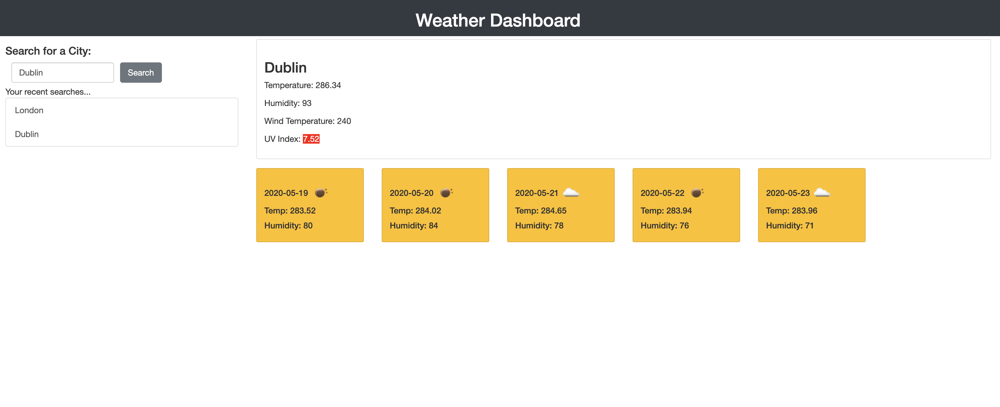

# Weather Dashboard

## Table of contents

- [Access](#access)
- [Technologies](#technologies)
- [How To Use](#how-to-use)
- [Screenshots](#screenshots)

## Access

The website for this quiz can be accessed at the following links:

GitHub Repository: https://github.com/steph-morrissey/steph-morrissey-homework-week-6

GitHub Pages: https://steph-morrissey.github.io/steph-morrissey-homework-week-6/

## Technologies

Project is created with:

- BootstraP v4.4.1: https://getbootstrap.com/
- Moment.js 2.24.0: https://momentjs.com/
- OpenWeatherAPI: https://openweathermap.org/

## How To Use

- To search for both the weather forecast for a particular location, simply enter within the search bar and then click Search

- You will be able to view both current day weather forecast, as well as forecasts for the next 5 days

- All recently searched locations will be saved, which you can click on to see that particular city's forecast

## Screenshots

- Weather Dashboard displaying both current day and five day weather forecasts
